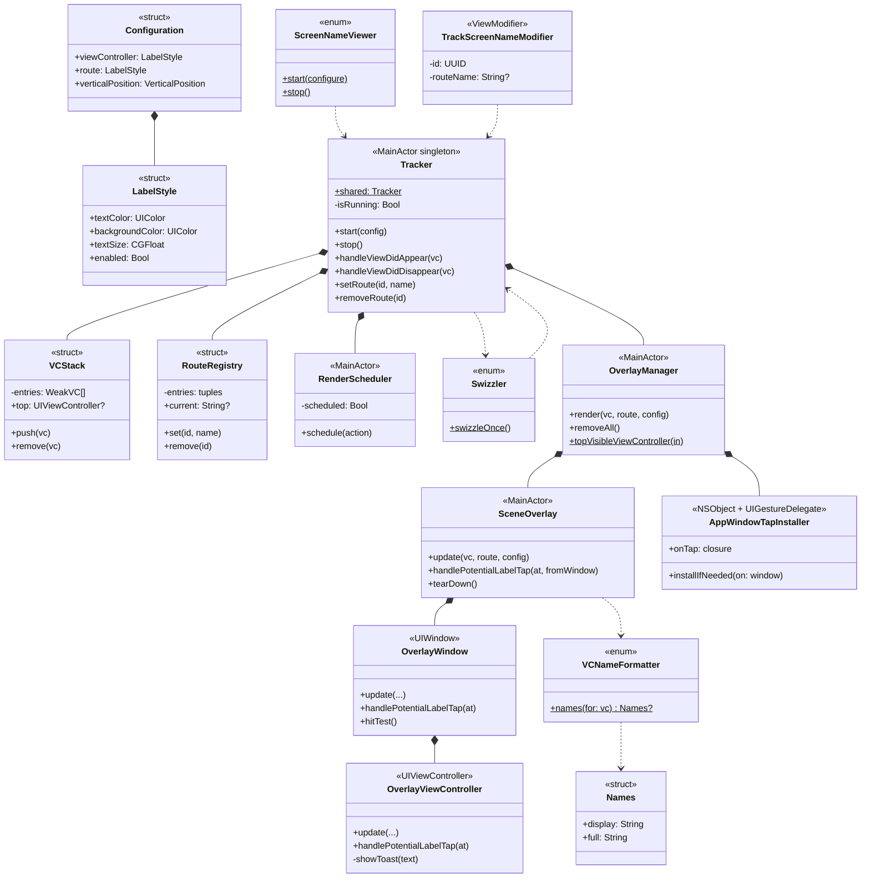

# ScreenNameViewer-For-iOS
[](https://myhits.vercel.app)
[](https://developer.apple.com/ios)
[](https://developer.apple.com/ios)
[](https://swift.org)
[](https://swift.org/package-manager/)


**[한국어 README](./README_ko.md)**

## Overview

<!-- Sample image placeholder -->
<!--  -->

ScreenNameViewer is a debugging tool that overlays the class name of the currently displayed screen.
It allows you to intuitively check which screen is active, and in a SwiftUI environment, it can also display the `NavigationStack` route.

This allows you to quickly find and navigate to the code for the desired screen, improving both debugging and development efficiency.

<br>

## Features

- **Real-time class name display**: Shows `UIViewController` class names and `NavigationStack` route on screen in real-time
- **Automatic lifecycle tracking**: Automatically tracks all `UIViewController`s using method swizzling at the application level
- **Debug-only**: All internal code wrapped in `#if DEBUG` — automatically disabled in RELEASE builds with zero runtime cost
- **UI customization**: Freely configure text size, color, vertical position, etc.
- **Memory safe**: Prevents memory leaks using weak references and automatic cleanup
- **Touch interaction**: Tap label to display full class name in toast — non-label areas pass through, never blocking the underlying app
- **Both SwiftUI and UIKit**: One library covers both frameworks

<br>

## Installation

### Swift Package Manager

In Xcode, `File → Add Package Dependencies...` and enter:

```
https://github.com/DongLab-DevTools/ScreenNameViewer-For-iOS
```

Or add directly to `Package.swift`:

```swift
dependencies: [
    .package(url: "https://github.com/DongLab-DevTools/ScreenNameViewer-For-iOS", from: "1.0.0")
]
```

Add to your target's dependencies:

```swift
.target(
    name: "MyApp",
    dependencies: ["ScreenNameViewer"]
)
```

<br>

### Requirements

- iOS 16.0 or higher
- Swift 5.9 or higher (Xcode 15+)

<br>

## Usage

### UIKit

Call `ScreenNameViewer.start()` once in your `AppDelegate`. Every `UIViewController` is then automatically tracked via method swizzling — no further code changes needed.

```swift
import UIKit
import ScreenNameViewer

@main
final class AppDelegate: UIResponder, UIApplicationDelegate {
    func application(
        _ application: UIApplication,
        didFinishLaunchingWithOptions launchOptions: [UIApplication.LaunchOptionsKey: Any]?
    ) -> Bool {
        ScreenNameViewer.start()
        return true
    }
}
```

The left label automatically displays the class name of the currently visible `UIViewController`.

<br>

### SwiftUI

#### 1. Initialize at the App entry point

```swift
import SwiftUI
import ScreenNameViewer

@main
struct MyApp: App {
    init() {
        ScreenNameViewer.start()
    }

    var body: some Scene {
        WindowGroup {
            ContentView()
        }
    }
}
```

This alone tracks every screen, but SwiftUI views are hosted by `UIHostingController` whose class name is filtered out as framework noise. To show meaningful names for SwiftUI screens, add the modifiers below.

#### 2. Track NavigationStack routes

Apply once on the root `NavigationStack`. Push/pop transitions automatically update the right label.

```swift
struct ContentView: View {
    @State private var path: [Route] = []

    var body: some View {
        NavigationStack(path: $path) {
            // ...destinations
        }
        .trackScreenName(path: path)
    }
}
```

#### 3. Sheet / Tab / Cover — explicit tracking

For screens outside the NavigationStack path, declare the name explicitly:

```swift
.sheet(isPresented: $showSheet) {
    SheetView()
        .trackScreenName("StandardSheet")
}

.fullScreenCover(isPresented: $showCover) {
    CoverView()
        .trackScreenName("FullScreenCover")
}

TabView {
    HomeView()
        .trackScreenName("Tab.Home")
        .tabItem { Label("Home", systemImage: "house") }
}
```

Stack-friendly — when a sheet is on screen, its name takes precedence; on dismissal the previous value is automatically restored.

<br>

## Configuration

### Configuration

Customize the overlay appearance via `start { config in ... }`:

```swift
ScreenNameViewer.start { config in
    // Left label — UIViewController name
    config.viewController.textColor = .white
    config.viewController.backgroundColor = UIColor.black.withAlphaComponent(0.7)
    config.viewController.textSize = 12
    config.viewController.enabled = true

    // Right label — NavigationStack route
    config.route.textColor = .systemYellow
    config.route.backgroundColor = UIColor.black.withAlphaComponent(0.7)
    config.route.textSize = 12

    // Vertical position (top / bottom). Horizontal placement is fixed (left/right).
    config.verticalPosition = .top
}
```

<br>

### Configuration Options

- **viewController** / **route**: Style for each label
  - `textColor`: Text color
  - `backgroundColor`: Background color
  - `textSize`: Text size
  - `enabled`: Whether the label is visible
  - `paddingHorizontal` / `paddingVertical`: Internal padding
  - `cornerRadius`: Corner radius

- **verticalPosition**: Vertical position of the overlay (`.top` / `.bottom`)
  Horizontal position is fixed: viewController on the left, route on the right

<br>

## How it works

The name shown in the overlay is normalized to always be a symbol from the user's own codebase:

1. `String(describing: type(of: vc))` → full name (e.g., `MyApp.HomeViewController`, `UIHostingController<...>`)
2. Strip generic `<...>` parameters → `UIHostingController`
3. Strip module prefix → `HomeViewController`
4. Returns `nil` if the result is an Apple framework base class (`UIViewController`, `UINavigationController`, `UITabBarController`, `UIHostingController`, etc.) — the label is auto-hidden

→ The text shown in the overlay is always grep-able. Use `Open Quickly` (⇧⌘O) or grep to jump straight to the file.

<br>

## Sample app

A demo app is included in the repository:

- **SwiftUI**: Basic / Deep Navigation / Sheet / Full-Screen Cover / TabView
- **UIKit**: `UINavigationController` / `UITabBarController` / Modal / Container ViewController

Open `ScreenNameViewer-For-iOS.xcodeproj` and run to see the library in action across each case.

<br>

## Architecture



**Notation**

- `*--` composition (the parent owns the child instance directly)
- `..>` dependency (calls only, no ownership)
- `<<...>>` stereotype (struct / enum / MainActor class / UIWindow, etc.)
- `+` public, `-` private, `$` static

<br>

## Contributors

<!-- readme: collaborators,contributors -start -->
<table>
    <tbody>
        <tr>
            <td align="center">
                <a href="https://github.com/dongx0915">
                    
                    <br />
                    <sub><b>Donghyeon Kim</b></sub>
                </a>
            </td>
        </tr>
    <tbody>
</table>
<!-- readme: collaborators,contributors -end -->
