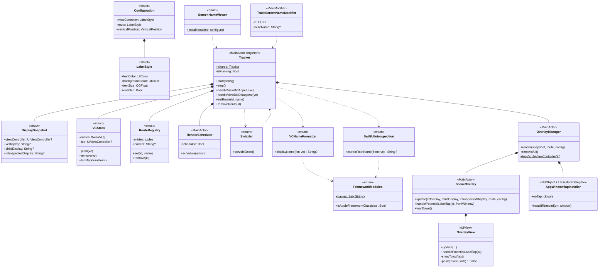

# ScreenNameViewer-For-iOS

[](https://myhits.vercel.app)
[](https://developer.apple.com/ios)
[](https://developer.apple.com/ios)
[](https://swift.org)
[](https://swift.org/package-manager/)


**[한국어 README](./README_ko.md)**

## Overview

<!-- Sample image placeholder -->
<!--  -->

ScreenNameViewer is a debugging tool that displays the name of the currently visible screen as an overlay.

In UIKit, it shows the currently visible `UIViewController` name.  
In SwiftUI, it can also show the current `NavigationStack` Route name.

This helps you quickly identify which file the current screen is defined in, improving debugging and development efficiency.

<br>

## Features

- **Real-time screen name display**: Shows the current `UIViewController` name and SwiftUI `NavigationStack` Route in real time
- **Automatic lifecycle tracking**: Tracks the current screen based on the `UIViewController` lifecycle
- **DEBUG only**: Internal code is wrapped in `#if DEBUG`, so it is automatically disabled in RELEASE builds — zero runtime cost
- **UI customization**: Customize text size, color, vertical position, and more
- **Memory safe**: Prevents memory leaks using weak references and automatic cleanup
- **Touch interaction**: Tap a label to show the full name in a toast. Non-label areas pass through and never block the underlying app
- **Both SwiftUI and UIKit**: One library covers both frameworks

<br>

## Installation

### Swift Package Manager

In Xcode, open `File → Add Package Dependencies...` and enter:

```swift
https://github.com/DongLab-DevTools/ScreenNameViewer-For-iOS
```

Or add it directly to `Package.swift`:

```swift
dependencies: [
    .package(url: "https://github.com/DongLab-DevTools/ScreenNameViewer-For-iOS", from: "1.0.0")
]
```

Add it to your target dependencies:

```swift
.target(
    name: "MyApp",
    dependencies: ["ScreenNameViewer"]
)
```

<br>

### Requirements

- iOS 16.0 or higher deployment target
- Xcode 15 or higher
- Swift 5.9 or higher

<br>

## Usage

### UIKit

- Call `ScreenNameViewer.install()` in `AppDelegate`.
- The class name of the currently visible `UIViewController` is automatically shown on the left label.

```swift
import UIKit
import ScreenNameViewer

@main
final class AppDelegate: UIResponder, UIApplicationDelegate {
    func application(
        _ application: UIApplication,
        didFinishLaunchingWithOptions launchOptions: [UIApplication.LaunchOptionsKey: Any]?
    ) -> Bool {
        ScreenNameViewer.install()
        return true
    }
}
```

<br>

### SwiftUI

#### 1. Initialize at the App entry point

- If your app uses the SwiftUI App lifecycle, call `ScreenNameViewer.install()` in `App.init()`.

```swift
import SwiftUI
import ScreenNameViewer

@main
struct MyApp: App {
    init() {
        ScreenNameViewer.install()
    }

    var body: some Scene {
        WindowGroup {
            ContentView()
        }
    }
}
```

<br>

#### 2. Track NavigationStack Route

- Initialization alone enables current screen tracking.
- To display the `NavigationStack` Route name in SwiftUI, add the modifier below. The right label is automatically updated on push/pop.

```swift
struct ContentView: View {
    @State private var path: [Route] = []

    var body: some View {
        NavigationStack(path: $path) {
            // ...destinations
        }
        .trackScreenName(path: path)
    }
}
```

<br>

#### 3. When NavigationStack has no path

- If you use `NavigationLink(value:)` without a path on `NavigationStack`, automatic tracking is not possible.
- In this case, you can use the wrapper instead of `navigationDestination`.
- It automatically generates a screen name based on the value received by the destination closure.

```swift
NavigationStack {
    VStack {
        NavigationLink("Go to screen 1", value: "1")
        NavigationLink("Go to screen 2", value: "2")
    }
    .navigationDestinationWithScreenName(for: String.self) { value in
        Text("This is screen number \(value)")
    }
}
```

- Display example: `ContentView.swift : value: 1`

<br>

#### 4. Sheet / Tab / Cover — Explicit Route

- Screens outside the `NavigationStack` path cannot be tracked automatically.
- In this case, you can explicitly declare a name with `.trackScreenName("ScreenName")` as needed.

```swift
.sheet(isPresented: $showSheet) {
    SheetView()
        .trackScreenName("StandardSheet")
}

.fullScreenCover(isPresented: $showCover) {
    CoverView()
        .trackScreenName("FullScreenCover")
}

TabView {
    HomeView()
        .trackScreenName("Tab.Home")
        .tabItem { Label("Home", systemImage: "house") }
}
```

<br>

## Configuration

### Configuration

You can customize the overlay style with `install { config in ... }`.

```swift
ScreenNameViewer.install { config in
    // Left label — UIViewController name
    config.viewController.textColor = .white
    config.viewController.backgroundColor = UIColor.black.withAlphaComponent(0.7)
    config.viewController.textSize = 12
    config.viewController.enabled = true

    // Right label — NavigationStack Route
    config.route.textColor = .systemYellow
    config.route.backgroundColor = UIColor.black.withAlphaComponent(0.7)
    config.route.textSize = 12

    // Vertical position: top / bottom
    // Horizontal placement is fixed: left(viewController) / right(route)
    config.verticalPosition = .top
}
```

<br>

### Configuration Options

- **viewController** / **route**: Style for each label
  - `textColor`: Text color
  - `backgroundColor`: Background color
  - `textSize`: Text size
  - `enabled`: Whether the label is visible
  - `paddingHorizontal` / `paddingVertical`: Internal padding
  - `cornerRadius`: Corner radius

- **verticalPosition**: Vertical position of the overlay (`.top` / `.bottom`)
  - Horizontal placement is fixed: left(viewController) / right(route)

<br>

## How it works

ScreenNameViewer tracks the current screen information and displays it as debugging labels in the app screen.

**Left label**
   - Displays the current UIKit / SwiftUI View name.

**Right label**
   - Displays the current Route name of SwiftUI `NavigationStack`.

<br>

### UIKit / SwiftUI View name

- ScreenNameViewer hooks tracking logic into the `viewDidAppear / viewDidDisappear` call timing of `UIViewController` to track the currently visible `UIViewController`.
- It then removes generic / module prefixes from the class name and displays a name that is easy to find in user code on the left label.
- SwiftUI screens are hosted through `UIHostingController`, so ScreenNameViewer extracts the inner SwiftUI View name and displays it on the left label.

<br>

### SwiftUI Route

- SwiftUI Route tracking is enabled by declaring `.trackScreenName(path:)` on `NavigationStack`.
- When `path` changes, SwiftUI recomputes the View, and the Route name is updated based on the new `path.last`.
- The updated Route name is displayed on the right label.

<br>

### Name normalization

Names shown in the overlay are normalized so they can be searched directly in user code.

1. Get the full name with `String(describing: type(of: vc))`  
   Example: `MyApp.HomeViewController`, `UIHostingController<...>`

2. Remove generic `<...>` parts  
   Example: `UIHostingController<ContentView>` → `UIHostingController`

3. Remove module prefixes  
   Example: `MyApp.HomeViewController` → `HomeViewController`

4. Filter Apple framework base classes  
   Example: `UIViewController`, `UINavigationController`, `UITabBarController`, `UIHostingController`

<br>

→ The name shown on screen can be found immediately with grep or Xcode `Open Quickly`(⇧⌘O).

<br>

## Sample app

A demo app is included in the repository.

- **SwiftUI**: Basic / Deep Navigation / Sheet / Full-Screen Cover / TabView
- **UIKit**: `UINavigationController` / `UITabBarController` / Modal / Container ViewController

Open `ScreenNameViewer-For-iOS.xcodeproj` and run it to see how the library works in each case.

<br>

## Architecture



**Notation**

- `*--` composition: the parent directly owns the child instance
- `..>` dependency: calls only, no ownership
- `<<...>>` stereotype: struct / enum / MainActor class / ViewModifier, etc.
- `+` public
- `-` private
- `$` static

<br>

## Contributors

<!-- readme: collaborators,contributors -start -->
<table>
    <tbody>
        <tr>
            <td align="center">
                <a href="https://github.com/dongx0915">
                    
                    <br />
                    <sub><b>Donghyeon Kim</b></sub>
                </a>
            </td>
        </tr>
    <tbody>
</table>
<!-- readme: collaborators,contributors -end -->
