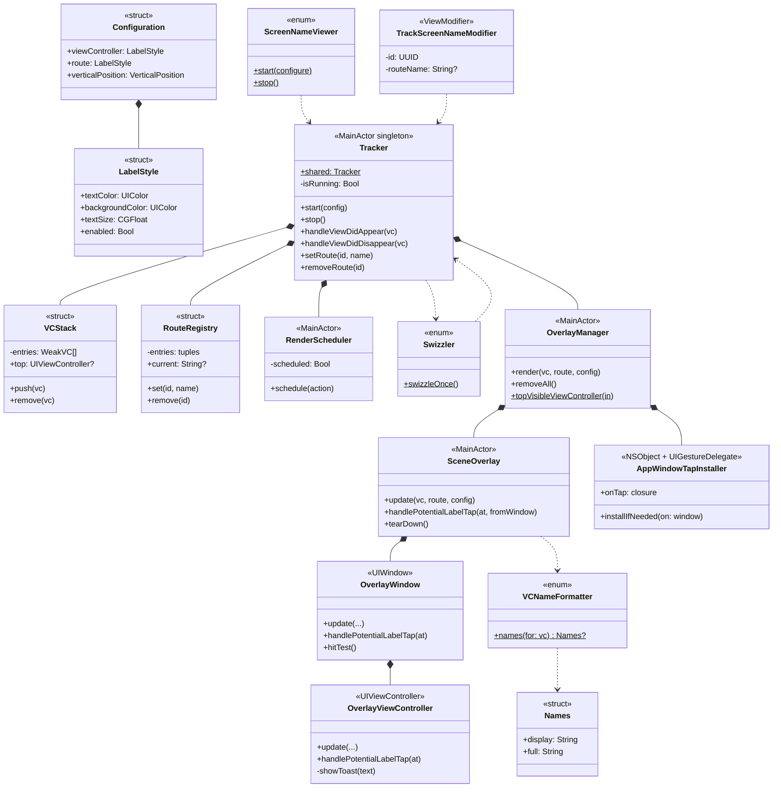

# ScreenNameViewer-For-iOS
[](https://myhits.vercel.app)
[](https://developer.apple.com/ios)
[](https://developer.apple.com/ios)
[](https://swift.org)
[](https://swift.org/package-manager/)


**[English README](./README.md)**

## 개요

<!-- 샘플 이미지 자리 -->
<!--  -->

ScreenNameViewer는 현재 표시 중인 화면의 클래스명을 오버레이로 보여주는 디버깅 도구입니다.
어떤 화면이 활성화되어 있는지 직관적으로 확인할 수 있으며, SwiftUI 환경에서는 `NavigationStack` 라우트까지 함께 표시할 수 있습니다.

이를 통해 원하는 화면의 코드를 빠르게 찾아 접근할 수 있어 디버깅과 개발 효율을 높여줍니다.

<br>

## 특징

- **실시간 클래스명 표시**: `UIViewController` 클래스명과 `NavigationStack` 라우트를 화면에 실시간 표시
- **자동 라이프사이클 추적**: Application 레벨에서 method swizzling으로 모든 `UIViewController`를 자동 추적
- **DEBUG 전용**: 모든 내부 코드가 `#if DEBUG`로 감싸져 있어 RELEASE 빌드에서는 자동 비활성화 — 런타임 비용 0
- **UI 커스터마이징**: 텍스트 크기, 색상, 수직 위치 등 자유롭게 설정 가능
- **메모리 안전**: 약한 참조 + 자동 정리로 메모리 누수 방지
- **터치 상호작용**: 라벨 터치 시 풀 클래스명 토스트 표시, 그 외 영역은 모두 통과 — 기존 화면의 터치 막지 않음
- **SwiftUI / UIKit 모두 지원**: 한 라이브러리로 두 프레임워크 동시 커버

<br>

## 설치

### Swift Package Manager

Xcode에서 `File → Add Package Dependencies...` 다이얼로그에 다음 URL 입력:

```
https://github.com/DongLab-DevTools/ScreenNameViewer-For-iOS
```

또는 `Package.swift`의 dependencies에 직접 추가:

```swift
dependencies: [
    .package(url: "https://github.com/DongLab-DevTools/ScreenNameViewer-For-iOS", from: "1.0.0")
]
```

타겟의 dependencies에도 추가:

```swift
.target(
    name: "MyApp",
    dependencies: ["ScreenNameViewer"]
)
```

<br>

### 요구사항

- iOS 16.0 이상
- Swift 5.9 이상 (Xcode 15+)

<br>

## 사용법

### UIKit

`AppDelegate`에서 `ScreenNameViewer.start()` 한 번만 호출하면 모든 `UIViewController`가 method swizzling으로 자동 추적됩니다. 추가 코드 작업은 필요 없습니다.

```swift
import UIKit
import ScreenNameViewer

@main
final class AppDelegate: UIResponder, UIApplicationDelegate {
    func application(
        _ application: UIApplication,
        didFinishLaunchingWithOptions launchOptions: [UIApplication.LaunchOptionsKey: Any]?
    ) -> Bool {
        ScreenNameViewer.start()
        return true
    }
}
```

좌측 라벨에 현재 표시 중인 `UIViewController`의 클래스명이 자동으로 표시됩니다.

<br>

### SwiftUI

#### 1. App 진입점에서 초기화

```swift
import SwiftUI
import ScreenNameViewer

@main
struct MyApp: App {
    init() {
        ScreenNameViewer.start()
    }

    var body: some Scene {
        WindowGroup {
            ContentView()
        }
    }
}
```

이것만으로도 모든 화면이 추적되지만 SwiftUI 뷰는 `UIHostingController`가 호스팅해서 프레임워크 노이즈로 필터링되기 때문에 라벨에 표시되지 않습니다. SwiftUI 화면에 의미 있는 이름을 표시하려면 아래 모디파이어를 추가하세요.

#### 2. NavigationStack 라우트 추적

루트 `NavigationStack`에 한 번만 모디파이어를 추가합니다. push/pop 시 우측 라벨이 자동 갱신됩니다.

```swift
struct ContentView: View {
    @State private var path: [Route] = []

    var body: some View {
        NavigationStack(path: $path) {
            // ...destinations
        }
        .trackScreenName(path: path)
    }
}
```

`NavigationStack`에 path는 없지만 `NavigationLink(value:)`를 쓰는 경우에는 `navigationDestination` 대신 wrapper를 사용합니다. destination closure가 받은 value로 화면 이름을 자동 생성합니다.

```swift
NavigationStack {
    VStack {
        NavigationLink("Go to screen 1", value: "1")
        NavigationLink("Go to screen 2", value: "2")
    }
    .navigationDestinationWithScreenName(for: String.self) { value in
        Text("This is screen number \(value)")
    }
}
```

오버레이 예: `ContentView.swift : value: 1`

#### 3. 시트 / 탭 / Cover — 명시적 라우트

`NavigationStack` path 밖에 있는 화면은 별도로 명시합니다.

```swift
.sheet(isPresented: $showSheet) {
    SheetView()
        .trackScreenName("StandardSheet")
}

.fullScreenCover(isPresented: $showCover) {
    CoverView()
        .trackScreenName("FullScreenCover")
}

TabView {
    HomeView()
        .trackScreenName("Tab.Home")
        .tabItem { Label("Home", systemImage: "house") }
}
```

중첩 구조 친화 — 시트가 떠 있는 동안엔 그 값이 우선 표시되고, dismiss 되면 이전 값이 자동 복원됩니다.

<br>

## 설정

### Configuration

`start { config in ... }`로 외형 커스터마이징:

```swift
ScreenNameViewer.start { config in
    // 좌측 라벨 — UIViewController 이름
    config.viewController.textColor = .white
    config.viewController.backgroundColor = UIColor.black.withAlphaComponent(0.7)
    config.viewController.textSize = 12
    config.viewController.enabled = true

    // 우측 라벨 — NavigationStack 라우트
    config.route.textColor = .systemYellow
    config.route.backgroundColor = UIColor.black.withAlphaComponent(0.7)
    config.route.textSize = 12

    // 수직 위치 (top / bottom). 수평 위치는 좌/우 고정
    config.verticalPosition = .top

    // 항상 떠있는 chrome 류 child VC (예: mini-player) 는 추적에서 제외해
    // 본래 화면의 라벨이 그대로 유지되도록
    config.excludedClassNames = ["MiniPlayerChromeViewController"]
}
```

<br>

### 설정 옵션

- **viewController** / **route**: 두 라벨 각각의 스타일
  - `textColor`: 텍스트 색상
  - `backgroundColor`: 배경 색상
  - `textSize`: 텍스트 크기
  - `enabled`: 라벨 표시 여부
  - `paddingHorizontal` / `paddingVertical`: 내부 패딩
  - `cornerRadius`: 모서리 둥글기

- **verticalPosition**: 오버레이의 수직 위치 (`.top` / `.bottom`)
  수평 위치는 좌측(viewController) / 우측(route) 고정

- **excludedClassNames**: 추적에서 제외할 `UIViewController` 클래스명 (모듈 prefix 와 제너릭 인자 제외한 짧은 이름). 항상 떠있는 mini-player 류 chrome child VC 가 본래 화면 라벨을 덮어쓰지 않도록 막을 때 사용

### 익명 top VC fallback 동작

스택 top 의 VC 가 표시 이름을 못 뽑는 경우 (iOS 26+ SwiftUI 의 `PresentationHostingController<AnyView>` 같이 type-erase 된 호스트) 그 아래에서 가장 가까운 named VC 로 fallback. SwiftUI `.fullScreenCover` / `.sheet` 에 `.trackScreenName(...)` 안 붙여도 직전 화면의 라벨이 그대로 유지됨.

<br>

## 동작 원리

오버레이에 표시되는 이름은 항상 사용자 코드의 심볼이 되도록 정규화됩니다:

1. `String(describing: type(of: vc))` → 풀네임 획득 (예: `MyApp.HomeViewController`, `UIHostingController<...>`)
2. 제너릭 `<...>` 제거 → `UIHostingController`
3. 모듈 프리픽스 제거 → `HomeViewController`
4. 결과가 Apple 프레임워크 베이스 클래스(`UIViewController`, `UINavigationController`, `UITabBarController`, `UIHostingController` 등)면 nil 반환 → 라벨 자동 숨김

→ 화면에 보이는 이름은 항상 사용자 코드의 심볼이라 grep 또는 Xcode `Open Quickly`(⇧⌘O)로 즉시 파일 발견 가능

<br>

## 샘플 앱

레포 내부에 데모 앱이 포함되어 있습니다:

- **SwiftUI**: Basic / Deep Navigation / Sheet / Full-Screen Cover / TabView
- **UIKit**: `UINavigationController` / `UITabBarController` / Modal / Container ViewController

`ScreenNameViewer-For-iOS.xcodeproj`를 열고 실행하시면 각 케이스에서 라이브러리가 어떻게 동작하는지 확인할 수 있습니다.

<br>

## 아키텍처



**표기 의미**

- `*--` 컴포지션 (부모가 자식 인스턴스를 직접 보유)
- `..>` 의존 (호출만, 소유 X)
- `<<...>>` 스테레오타입 (struct / enum / MainActor 클래스 / UIWindow 등)
- `+` public, `-` private, `$` static

<br>

## 기여자

<!-- readme: collaborators,contributors -start -->
<table>
    <tbody>
        <tr>
            <td align="center">
                <a href="https://github.com/dongx0915">
                    
                    <br />
                    <sub><b>Donghyeon Kim</b></sub>
                </a>
            </td>
        </tr>
    <tbody>
</table>
<!-- readme: collaborators,contributors -end -->
