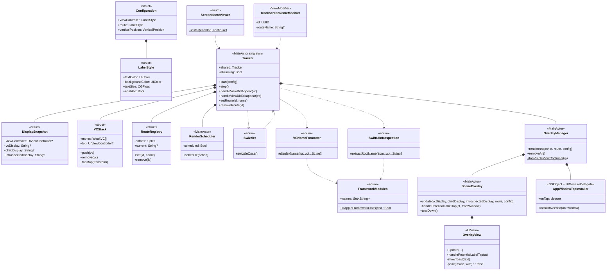

# ScreenNameViewer-For-iOS

[](https://developer.apple.com/ios)
[](https://myhits.vercel.app)


[](https://github.com/DongLab-DevTools/ScreenNameViewer-For-iOS/releases)
[](https://swift.org/package-manager/)
[](https://developer.apple.com/ios)
[](https://swift.org)

**[English README](./README.md)**

## 개요

<!-- 샘플 이미지 자리 -->


<br>
<br>

ScreenNameViewer는 현재 표시 중인 화면의 이름을 오버레이로 보여주는 디버깅 도구입니다.

UIKit에서는 현재 표시 중인 `UIViewController` 이름을, SwiftUI에서는 `NavigationStack`의 Route 이름까지 함께 확인할 수 있습니다.

이를 통해 현재 화면이 어떤 파일에 정의되어 있는지 빠르게 파악할 수 있어 디버깅과 개발 효율을 높여줍니다.

<br>

## 특징

- **실시간 화면 이름 표시**: 현재 표시 중인 `UIViewController` 이름과 SwiftUI `NavigationStack` Route를 화면에 실시간 표시
- **자동 라이프사이클 추적**: `UIViewController`의 lifecycle을 기반으로 현재 화면 자동 추적
- **DEBUG 전용**: 내부 코드가 `#if DEBUG`로 감싸져 있어 RELEASE 빌드에서는 자동 비활성화 — 런타임 비용 0
- **UI 커스터마이징**: 텍스트 크기, 색상, 수직 위치 등 자유롭게 설정 가능
- **메모리 안전**: 약한 참조 + 자동 정리로 메모리 누수 방지
- **터치 상호작용**: 라벨 터치 시 전체 이름을 토스트로 표시, 그 외 영역은 모두 통과 — 기존 화면의 터치 막지 않음
- **SwiftUI / UIKit 모두 지원**: 한 라이브러리로 두 프레임워크 동시 커버

<br>

## 설치

### Swift Package Manager

Xcode에서 `File → Add Package Dependencies...` 다이얼로그에 다음 URL 입력:

```swift
https://github.com/DongLab-DevTools/ScreenNameViewer-For-iOS
```

또는 `Package.swift`의 dependencies에 직접 추가:

```swift
dependencies: [
    .package(url: "https://github.com/DongLab-DevTools/ScreenNameViewer-For-iOS", from: "1.0.0")
]
```

타겟의 dependencies에도 추가:

```swift
.target(
    name: "MyApp",
    dependencies: ["ScreenNameViewer"]
)
```

<br>

### 요구사항

- iOS 16.0 이상 deployment target
- Xcode 15 이상
- Swift 5.9 이상

<br>

## 사용법

### UIKit

- `AppDelegate`에서 `ScreenNameViewer.install()`을 호출합니다.
- 좌측 라벨에 현재 표시 중인 `UIViewController`의 클래스명이 자동으로 표시됩니다.

```swift
import UIKit
import ScreenNameViewer

@main
final class AppDelegate: UIResponder, UIApplicationDelegate {
    func application(
        _ application: UIApplication,
        didFinishLaunchingWithOptions launchOptions: [UIApplication.LaunchOptionsKey: Any]?
    ) -> Bool {
        ScreenNameViewer.install()
        return true
    }
}
```

<br>

### SwiftUI

#### 1. App 진입점에서 초기화
- SwiftUI App lifecycle을 사용하는 경우, `App.init()`에서 `ScreenNameViewer.install()`을 호출합니다.

```swift
import SwiftUI
import ScreenNameViewer

@main
struct MyApp: App {
    init() {
        ScreenNameViewer.install()
    }

    var body: some Scene {
        WindowGroup {
            ContentView()
        }
    }
}
```

<br>

#### 2. NavigationStack Route 추적
- 초기화만으로도 현재 화면에 대한 추적은 동작합니다.
- SwiftUI에서 `NavigationStack`의 Route 이름까지 표시하려면 아래 modifier를 추가합니다. 이후 push/pop 시 우측 라벨이 자동 갱신됩니다.

```swift
struct ContentView: View {
    @State private var path: [Route] = []

    var body: some View {
        NavigationStack(path: $path) {
            // ...destinations
        }
        .trackScreenName(path: path)
    }
}
```

<br>

#### 3. NavigationStack에 path가 없는 경우
- `NavigationStack`에 path 없이 `NavigationLink(value:)`를 사용하는 경우에는 자동 추적이 불가능합니다.
- 이 경우 `navigationDestination` 대신 wrapper를 사용할 수 있습니다.
- destination closure가 받은 value를 기준으로 화면 이름을 자동 생성합니다.

```swift
NavigationStack {
    VStack {
        NavigationLink("Go to screen 1", value: "1")
        NavigationLink("Go to screen 2", value: "2")
    }
    .navigationDestinationWithScreenName(for: String.self) { value in
        Text("This is screen number \(value)")
    }
}
```

- 노출 예시: `ContentView.swift : value: 1`

<br>

#### 4. 시트 / 탭 / Cover — 명시적 Route
- `NavigationStack` path 밖에 있는 화면은 자동 추적이 불가능합니다.
- 이 경우 필요에 따라 `.trackScreenName("화면이름")`을 명시적으로 선언할 수 있습니다.

```swift
.sheet(isPresented: $showSheet) {
    SheetView()
        .trackScreenName("StandardSheet")
}

.fullScreenCover(isPresented: $showCover) {
    CoverView()
        .trackScreenName("FullScreenCover")
}

TabView {
    HomeView()
        .trackScreenName("Tab.Home")
        .tabItem { Label("Home", systemImage: "house") }
}
```

<br>

## 설정

### Configuration

`install { config in ... }`로 오버레이 스타일을 커스터마이징할 수 있습니다.

```swift
ScreenNameViewer.install { config in
    // 좌측 라벨 — UIViewController 이름
    config.viewController.textColor = .white
    config.viewController.backgroundColor = UIColor.black.withAlphaComponent(0.7)
    config.viewController.textSize = 12
    config.viewController.enabled = true

    // 우측 라벨 — NavigationStack Route
    config.route.textColor = .systemYellow
    config.route.backgroundColor = UIColor.black.withAlphaComponent(0.7)
    config.route.textSize = 12

    // 수직 위치: top / bottom
    // 수평 위치는 좌측(viewController) / 우측(route) 고정
    config.verticalPosition = .top
}
```

<br>

### 설정 옵션

- **viewController** / **route**: 두 라벨 각각의 스타일
  - `textColor`: 텍스트 색상
  - `backgroundColor`: 배경 색상
  - `textSize`: 텍스트 크기
  - `enabled`: 라벨 표시 여부
  - `paddingHorizontal` / `paddingVertical`: 내부 패딩
  - `cornerRadius`: 모서리 둥글기

- **verticalPosition**: 오버레이의 수직 위치 (`.top` / `.bottom`)
  - 수평 위치는 좌측(viewController) / 우측(route) 고정

<br>

## 동작 원리

ScreenNameViewer는 현재 화면 정보를 추적하고, 이를 디버깅용 라벨로 앱 화면에 표시합니다.

**좌측 라벨**
   - 현재 화면의 UIKit / SwiftUI View 이름이 표시됩니다.

**우측 라벨**
   - SwiftUI `NavigationStack`의 현재 Route 이름이 표시됩니다.

<br>

### UIKit / SwiftUI View 이름

- `UIViewController`의 `viewDidAppear / viewDidDisappear` 호출 시점에 추적 로직을 함께 실행하도록 연결하여 현재 보이는 `UIViewController`를 추적합니다.
- 이후 클래스명에서 generic / module prefix를 정리하고, 사용자 코드에서 찾기 쉬운 이름만 좌측 라벨에 표시합니다.
- SwiftUI 화면은 `UIHostingController`를 통해 호스팅되므로, 내부 SwiftUI View 이름을 추출해 좌측 라벨에 표시합니다.

<br>

### SwiftUI Route

- SwiftUI Route는 `NavigationStack`에 `.trackScreenName(path:)`를 선언하여 추적합니다.
- `path`가 변경되면 SwiftUI가 View를 다시 그리고, 새 `path.last` 기준으로 Route 이름이 갱신됩니다.
- 갱신된 Route 이름은 우측 라벨에 표시됩니다.

<br>

### 이름 정규화

오버레이에 표시되는 이름은 사용자 코드에서 바로 검색할 수 있도록 정규화됩니다.

1. `String(describing: type(of: vc))` → 전체 이름 획득  
   예: `MyApp.HomeViewController`, `UIHostingController<...>`

2. generic `<...>` 제거  
   예: `UIHostingController<ContentView>` → `UIHostingController`

3. module prefix 제거  
   예: `MyApp.HomeViewController` → `HomeViewController`

4. Apple framework 기본 클래스는 필터링  
   예: `UIViewController`, `UINavigationController`, `UITabBarController`, `UIHostingController`

<br>

→ 화면에 보이는 이름은 grep 또는 Xcode `Open Quickly`(⇧⌘O)로 바로 찾을 수 있습니다.

<br>

## 샘플 앱

레포 내부에 데모 앱이 포함되어 있습니다.

- **SwiftUI**: Basic / Deep Navigation / Sheet / Full-Screen Cover / TabView
- **UIKit**: `UINavigationController` / `UITabBarController` / Modal / Container ViewController

`ScreenNameViewer-For-iOS.xcodeproj`를 열고 실행하시면 각 케이스에서 라이브러리가 어떻게 동작하는지 확인할 수 있습니다.

<br>

## 아키텍처



**표기 의미**

- `*--` 컴포지션: 부모가 자식 인스턴스를 직접 보유
- `..>` 의존: 호출만 하고 소유하지 않음
- `<<...>>` 스테레오타입: struct / enum / MainActor class / ViewModifier 등
- `+` public
- `-` private
- `$` static

<br>

## 기여자

<!-- readme: collaborators,contributors -start -->
<table>
    <tbody>
        <tr>
            <td align="center">
                <a href="https://github.com/dongx0915">
                    
                    <br />
                    <sub><b>Donghyeon Kim</b></sub>
                </a>
            </td>
        </tr>
    <tbody>
</table>
<!-- readme: collaborators,contributors -end -->
